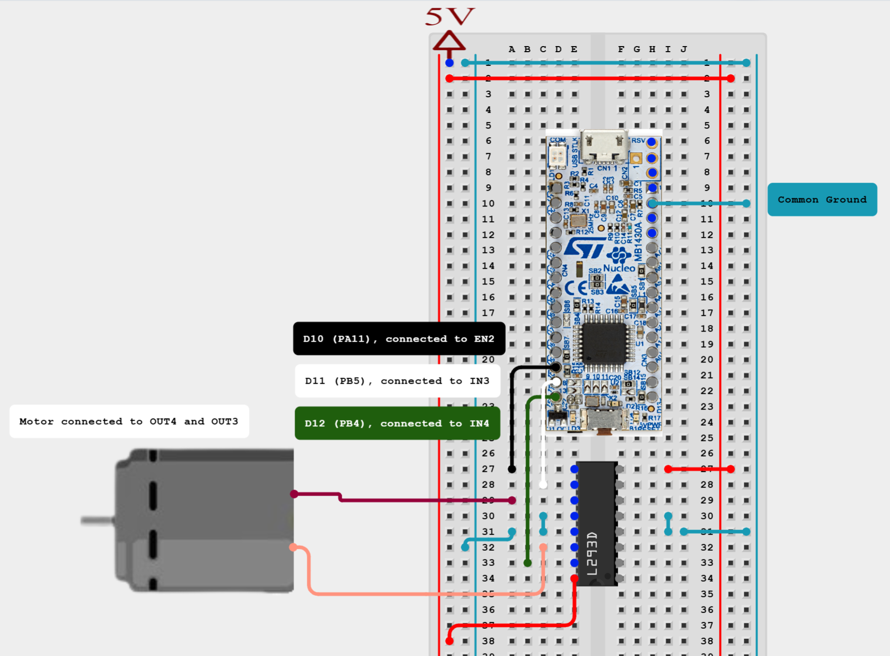
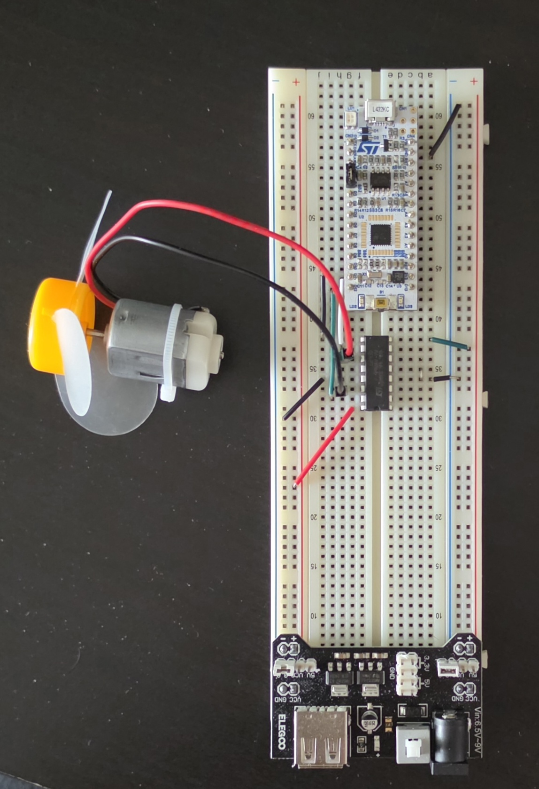

# Project 4: DC Motor Speed Control (Fixed PWM + UART Debug)

This project demonstrates DC motor speed control using an **STM32L432KC Nucleo board**, an **L293D H-bridge motor driver**, and **fixed PWM duty cycling via TIM1**.

Unlike joystick-based control, this project does **not use ADC input**. Instead, it cycles through predefined motor speeds (full speed → half speed) while sending real-time status updates over UART.

---

## 🧠 Overview

The system performs the following loop:

1. Motor runs at **full speed (PWM duty ≈ 500)**
2. Motor runs at **half speed (PWM duty ≈ 250)**
3. UART terminal is cleared using ANSI escape codes
4. Loop repeats indefinitely

Motor direction is fixed (no reversing logic), and speed is controlled using **TIM1 PWM Channel 4**.

---

## ⚙️ Features

- PWM-based motor speed control (TIM1 CH4)
- UART debugging output via USART2 (115200 baud)
- L293D H-bridge motor driver control
- Fixed direction motor operation
- Speed switching (full → half)
- Terminal clearing using ANSI escape sequences
- STM32 HAL-based implementation

---

## 🔌 Hardware Setup

This project uses:
- STM32L432KC Nucleo board
- L293D H-bridge motor driver
- DC motor

Motor direction is controlled using GPIO pins connected to the L293D, while speed is controlled using PWM output from TIM1 Channel 4.

---

## 📌 Pin Mapping

| Physical Pin | Function | GPIO Variable Name | Description |
|--------------|----------|--------------------|-------------|
| PA11 | PWM output (TIM1 CH4) | `PWM_Motor` | Controls motor speed via PWM duty cycle |
| PB4 | Motor output A | `pin_4A` | L293D IN1 (direction control) |
| PB5 | Motor output B | `pin_3A` | L293D IN2 (direction control) |
| PB3 | LED indicator | `LD3` | Onboard status LED |
| PA2 | UART Transmit | `USART2_TX` | Serial debug output |
| PA3 | UART Receive | `USART2_RX` | Serial debug input |

---
## 🖼️ Circuit Diagram





---

## 🔄 Motor Control Logic

| pin_4A | pin_3A | PWM (TIM1->CCR4) | Behavior |
|--------|--------|------------------|----------|
| 1      | 0      | 500              | Full speed forward |
| 1      | 0      | 250              | Half speed forward |

---

## 📡 UART Output Example

Motor ON full speed  
Motor ON half speed  

Terminal is cleared using:

```
HAL_UART_Transmit(&huart2,
                  (uint8_t*)"\033[2J\033[H",
                  strlen("\033[2J\033[H"),
                  10);
```
