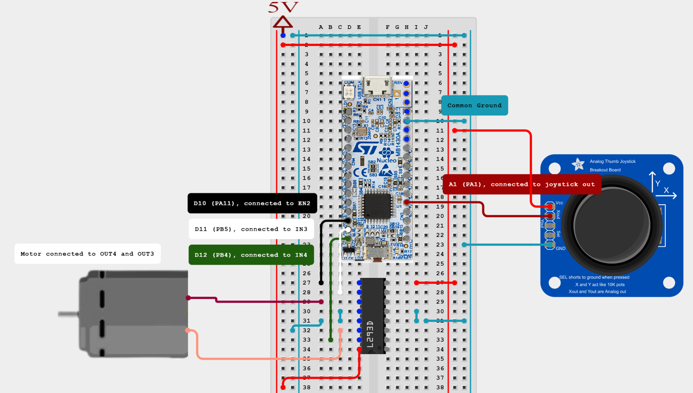
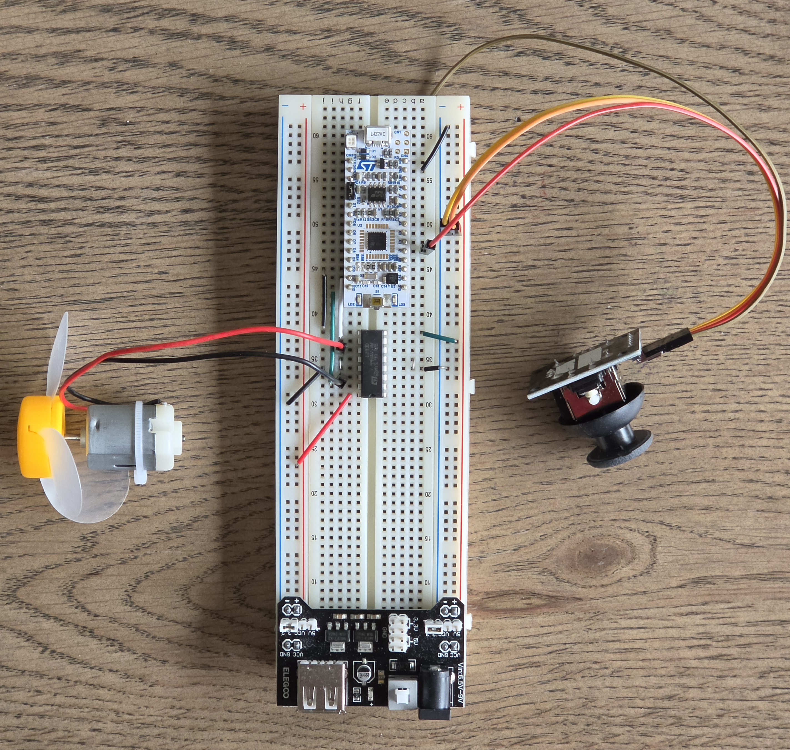

# Project 5: Motor Speed Control Using Joystick (ADC + PWM + UART)

This project demonstrates DC motor speed control using an STM32L432KC Nucleo board, where motor speed is adjusted in real time using a joystick (potentiometer). The system combines ADC input reading, PWM generation, GPIO motor direction control, and UART debugging output.

The goal is to map an analog joystick input to motor speed and observe real-time PWM modulation.

---

## 🧠 Overview

The firmware continuously:

1. Reads analog input from a joystick (potentiometer)
2. Converts it using the ADC (8-bit resolution)
3. Maps the ADC value to PWM duty cycle
4. Updates motor speed using TIM1 PWM
5. Sends ADC readings over UART for debugging

---

## ⚙️ Features

- ADC-based joystick/potentiometer input
- Real-time PWM motor speed control (TIM1 CH4)
- GPIO motor direction control (H-bridge inputs)
- UART debug output (USART2 @ 115200 baud)
- Continuous polling (superloop design)

---

## 🔌 Hardware Setup

This project uses:

- STM32L432KC Nucleo board
- DC motor
- L293D H-bridge motor driver
- Joystick / potentiometer (analog input)

The joystick controls motor speed by adjusting the voltage level read by the ADC.

---

## 📌 Pin Mapping

| STM32 Pin | Variable Name | Function | Description |
|------------|--------------|----------|-------------|
| PA1 | ADC_Input | ADC1_IN6 | Joystick / potentiometer analog input |
| PA11 | PWM_Motor | TIM1_CH4 | PWM output for motor speed control |
| PB5 | pin_3A | GPIO Output | Motor direction control (IN1 / 3A) |
| PB4 | pin_4A | GPIO Output | Motor direction control (IN2 / 4A) |
| PB3 | LD3 | GPIO Output | Onboard LED |
| PA2 | USART2_TX | USART2_TX | UART debug output |
| PA3 | USART2_RX | USART2_RX | UART debug input |

---
## 🖼️ Circuit Diagram

---

## 🔄 How It Works

### ADC Input
Joystick is connected to PA1 (ADC1_IN6 / ADC_CHANNEL_6).  
The ADC runs in 8-bit mode, giving values from 0 to 255.

---

### PWM Motor Control
TIM1 Channel 4 is used to generate PWM:

TIM1->CCR4 = ADC_RES * 2;

Higher joystick value → higher PWM duty cycle → faster motor speed.

---

### Motor Direction Control

PB5 = 1  
PB4 = 0  

This sets a fixed motor direction (clockwise).

---

### UART Debug Output

The system prints ADC values over UART:

ADC Value = 123  
ADC Value = 200  
ADC Value = 45  

---

## 📡 Signal Flow

Joystick (Potentiometer)  
↓  
PA1 (ADC1_IN6)  
↓  
ADC Conversion (8-bit)  
↓  
PWM Scaling (TIM1 CH4)  
↓  
Motor Speed Control  
↓  
UART Debug Output  

---

## 📊 Key Technical Details

- ADC Resolution: 8-bit (0–255)
- PWM Timer: TIM1 Channel 4
- PWM Scaling: ADC × 2
- UART Baud Rate: 115200
- Sampling Delay: 50 ms

---

## 📌 Important Notes

- ADC mapping:
  PA1 → ADC1_IN6 → ADC_CHANNEL_6

- PWM is hardware-generated using TIM1
- Motor direction is fixed in this version
- Speed is fully controlled via joystick input

---

## 🧪 Summary

This project demonstrates:

- Analog input reading using ADC
- Real-time motor speed control using PWM
- STM32 GPIO interfacing with L293D motor driver
- UART-based debugging and monitoring